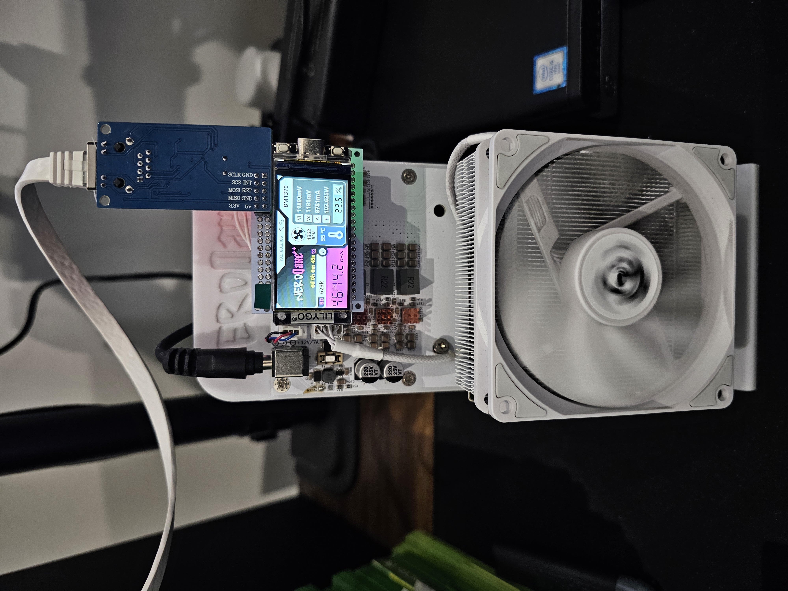

# Clean W5500-Ethernet firmware for the NerdQAxe++ (320×170 and 480×320)

Open, auditable firmware for the **NerdQAxe++**, with optional **W5500 Ethernet** and a build for each screen: the **stock 1.9" 320×170** panel and the **480×320 (3.5")** panel on the clones sold on AliExpress (sellers such as YYSlupping, among others). Those 480×320 clones ship with a **preinstalled binary firmware whose source isn't published**, so there's no way to see what it does with your pool credentials, payout address, or hashrate. This repo lets you replace it — on either screen — with a clean build compiled from the open [`shufps/ESP-Miner-NerdQAxePlus`](https://github.com/shufps/ESP-Miner-NerdQAxePlus) source, the same firmware the rest of the NerdQAxe community runs, so you know exactly what's on your miner.

| Supported Targets | ESP32-S3           |
| ----------------- | ------------------ |
| Required Platform | >= ESP-IDF v5.3.X  |

On top of upstream (tracking `shufps`'s `develop`), this fork adds:

1. **Optional W5500 Ethernet** — add a wired connection if you want one, via upstream's own native `Board::hasEthernet()` / `NetworkManager` support (the community-standard SPI pinout is [below](#ethernet-w5500-wiring)). **It's entirely optional — with no Ethernet shield the firmware runs on WiFi, exactly like stock.**
2. **Two screen builds from one source** — the stock **320×170** panel and the **480×320 (3.5")** panel the clones ship with (the big-screen support is ported from [brunneis/nerdqaxeplus2-3.5-inches](https://github.com/brunneis/nerdqaxeplus2-3.5-inches); upstream has said they won't support the 480×320 panel, so it's maintained here). Each release ships both; the in-app updater installs the one matching your screen automatically.

<table>
<tr>
<td align="center"></td>
<td align="center"></td>
</tr>
<tr>
<td align="center"><sub><b>480×320 (3.5")</b> clone + W5500 shield</sub></td>
<td align="center"><sub><b>320×170 (1.9")</b> stock screen + W5500 shield</sub></td>
</tr>
</table>

*Both running this fork with the W5500 shield installed. The **chain-link icon** at the top of the screen (beside the IP) means it's on a wired Ethernet connection — it's absent when running over WiFi.*

Credits:
- BitAxe devs on OSMU: @skot/ESP-Miner, @ben and @jhonny
- NerdAxe dev @BitMaker
- Upstream NerdQAxe firmware: @shufps

### Status

- ✅ Builds clean for `BOARD=NERDQAXEPLUS2`, target `esp32s3`, for **both screens** — `BIGSCREEN=1` (480×320) and `BIGSCREEN=0` (320×170). CI compile-checks both on every change.
- ✅ **Both screens verified on real hardware.** 480×320: the SquareLine-Studio layout (authored for 320×170) is scaled to fill the larger panel. 320×170: renders at upstream's native layout. Mining screen, fonts, network/status icons, and the block-found overlay all render correctly on each (panel-specific color encoding and fonts are selected per build).
- ✅ **Ethernet is hardware-verified** on a NerdQAxe++ with a W5500 shield: the wiring below is confirmed working and the board runs on Ethernet.

### Ethernet (W5500) wiring

Only 4 signal wires needed, matching the community-standard pinout from CryptoIceMLH's README (plus power/ground):

| Signal | GPIO |
|---|---|
| MOSI | 12 |
| MISO | 16 |
| SCLK | 2  |
| CS   | 21 |


*The W5500 module is drawn on top for reference only; it actually mounts on the opposite side of the board. The 12-pin pass-through header is where the NerdQAxe++ (ESP32) plugs in; the W5500 sits on the 5-pin headers.*

By default INT and RST aren't used — the driver polls, and these W5500 breakout modules reset themselves on power-up. (The firmware pulses GPIO4 as a no-op reset attempt on boot; harmless if unconnected, and overridable via `NerdQaxePlus2::getEthResetPin()`.)

Interrupt mode was hardware-tested: wiring **INT → GPIO11** and building with `W5500_USE_INT=1` works and boots cleanly. The shipped build still polls, though — on a hand-wired add-on shield the interrupt line picks up enough noise to perform *worse* than polling (higher latency/jitter), and the difference doesn't affect mining either way.

## Building this fork

Uses the repo's Docker toolchain, so you don't need ESP-IDF or Node installed locally (the image pins the tested ESP-IDF 5.3.3). **First time only**, build the container:

```bash
cd docker && ./build_docker.sh && cd ..
git submodule update --init --recursive   # if you didn't clone with --recursive
```

Then build — the two fork-specific bits are `BOARD=NERDQAXEPLUS2` and `BIGSCREEN`, which picks the screen:

```bash
export BOARD="NERDQAXEPLUS2"
export BIGSCREEN=1          # 1 = 480x320 (3.5") panel;  0 = stock 320x170 panel
./docker/idf.sh set-target esp32s3
./docker/idf.sh build
```

That produces `build/esp-miner.bin` (app) and `build/www.bin` (web UI). Switching `BIGSCREEN` needs a clean reconfigure, so `rm -rf build sdkconfig` between the two.

## Installing & updating

Every [Release](https://github.com/AguiMr/nerdqaxeplus2-ethernet/releases) attaches ready-to-flash binaries for **both screens** (or build your own — see above). Pick the files for your panel:

| Your screen | First-time USB flash | In-app / OTA update |
|---|---|---|
| **320×170** (1.9", stock) | `esp-miner-factory-NerdQAxe++-320x170-<ver>.bin` | `esp-miner-NerdQAxe++-320x170.bin` + `www.bin` |
| **480×320** (3.5") | `esp-miner-factory-NerdQAxe++-480x320-<ver>.bin` | `esp-miner-NerdQAxe++-480x320.bin` + `www.bin` |

**First install (coming from the stock/unknown firmware): USB serial.** The partition table differs from a stock NerdQAxePlus2 (app partitions enlarged for the theme assets — see `partitions.csv`), so the first flash can't be done over the air. Hold the `boot` button to enter bootloader mode, then flash the factory image for your screen at `0x0`:

```bash
esptool.py --chip esp32s3 -p /dev/ttyACM0 write_flash 0x0 esp-miner-factory-NerdQAxe++-<size>-<ver>.bin
# or:  ./docker/bitaxetool.sh --firmware esp-miner-factory-NerdQAxe++-<size>-<ver>.bin -p /dev/ttyACM0
```

(From a self-built tree instead: `idf.py -p /dev/ttyACM0 flash` inside `./docker/idf-shell.sh`, or `./merge_bin.sh nerdqaxe+.bin` to produce your own factory image.)

**Updating once you're already on this firmware — no USB needed:**
- **In-app (easiest):** web UI → Settings → **Update via GitHub** → pick the latest release. It detects your screen and installs the matching build automatically, preserving your settings (pool, overclock) in NVS.
- **Manual upload:** web UI → firmware upload (the `esp-miner-NerdQAxe++-<size>.bin` for your screen) and website upload (`www.bin`).

> Not on shufps's Webflasher — that only carries upstream builds, not these. Use this repo's own releases.

## Upstream features

This fork tracks `shufps/ESP-Miner-NerdQAxePlus`, so its generic features work unchanged — see the [upstream README](https://github.com/shufps/ESP-Miner-NerdQAxePlus) for full details:

- **Grafana / InfluxDB monitoring** — the firmware supports InfluxDB; upstream ships a Grafana dashboard and compose setup: https://github.com/shufps/ESP-Miner-NerdQAxePlus/tree/master/monitoring
